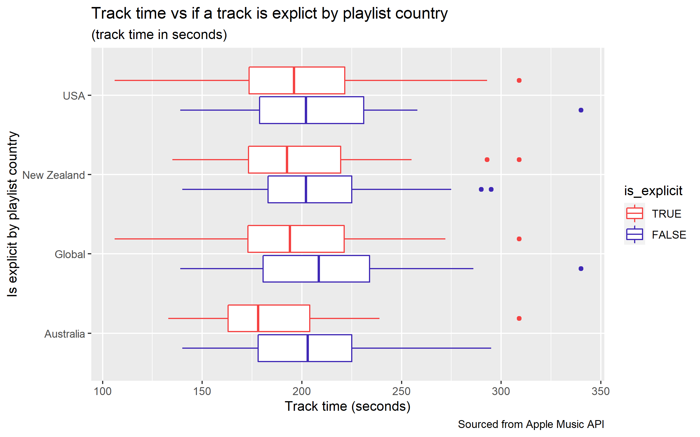

```{r setup, include=FALSE}
knitr::opts_chunk$set(echo = TRUE)
```

<div class="contents-border">
## Table of Contents
- [Intro](#intro)
- [Visualization](#visualization)
- [Data creation](#data-creation)
- [Final reflection](#final-reflection)
  - [Short note](#short-note)
- [Code appendix](#code-appendix)
  - [data_web.R](#data-web-r)
  - [data_api.R](#data-api-r)
  - [data_join.R](#data-join-r)
  - [data_viz.R](#data-viz-r)
  - [data_creativity.R](#data-creativity-r)
</div>

## Introduction {#intro}
<div class="row">
<div class="left-column">
Welcome to my report! I decided to choose the Top 100 Global, NZ, AU, and USA playlists. The reason why I chose those four playlists is because NZ and AU are quite geographically close together so trends tend to be similar, USA is where a lot of songs originate from and they are considered to be "trend setters", and the global playlist is just to "get a better idea" of trends.
</div>
<div class="right-column" style="margin-top: 0%">

</div>
</div>

<hr/>

## Visualization {#visualization}
<div class="row">
<div class="left-column">


</div>
<div class="right-column">
On the visualization that you see on the left, I wanted to compare the song lengths (in seconds) against explicitness, grouped by playlist country. As seen on the plot, the median track time for non-explicit songs seems to be longer than the median track time for explicit songs for all groups of plots by playlist country. Interestingly enough, the maximum track time for non-explicit songs is always higher than the maximum track time for explicit songs, apart from songs in the USA playlist. The interquartile ranges appear to be similar, and we have a couple of outliers toward the maximum side as well on all plots.
</div>
</div>

<hr/>

## Data creation {#data-creation}
<div class="row">
<div class="left-column">
For my creative data creation, I wanted to go back to earlier on in this course when we learned about vectors and image manipulation. On top of this, I also wanted to make use of the for-loop structures that we have learned recently. Thus, my final product is a slideshow GIF showing the top 10 songs from each of the playlists with the song name, artist, and album cover. I would have made the GIF larger, but the resolution of the album cover from the iTunes API is quite small, so scaling it any larger would make it look bad.
</div>
<div class="right-column">

</div>
</div>

<hr/>

## Final reflection {#final-reflection}
One important idea that I have learned from **Module 5** and doing this assignment is how we can leverage our R skills and knowledge to retrieve data off the internet via web scraping using `{rvest}`. Some more important and cool ideas that I learned/got to make use of was interacting with the iTunes API and using the `map_df()` function to combine data frames. One tricky and annoying situation that I ran into while web scraping was when I tried to scrape the artist names for songs. Multiple songs can have multiple artists, and these are separate HTML elements. That means the number of elements in the artist vector would exceed the number of elements in all the other vectors while web scraping, and this caused issues when calling `tibble()` as there was a mismatch in vector lengths.

In terms of my learning across all my assignments, I'm very happy with what I have learned in this course and what I have achieved. My assignment work was a direct result of what I had learned in the lectures and labs, and I feel that I did the work to a good standard. Working on the assignments definitely helped reinforce the knowledge from lectures and labs. I'm curious to learn more about web scraping and play around with more advanced techniques as I feel that we've only scratched the surface of what's possible.

### Short note {#short-note}
I'm sort of sad that this course is coming to an end as it's probably one of the best courses I have taken throughout my undergrad. Quick shoutout to Anna for being an excellent and enthusiastic lecturer throughout the past 12 weeks, and of course the lab tutors and other teaching staff associated with this course. Until next time 👋

<hr/>

## Code appendix {#code-appendix}

### `data_web.R` {#data-web-r}
```{r file='data_web.R', eval=FALSE}

```


### `data_api.R` {#data-api-r}
```{r file='data_api.R', eval=FALSE}

```


### `data_join.R` {#data-join-r}
```{r file='data_join.R', eval=FALSE}

```


### `data_viz.R` {#data-viz-r}
```{r file='data_viz.R', eval=FALSE}

```

### `data_creativity.R` {#data-creativity-r}
```{r file='data_creativity.R', eval=FALSE}

```

```{css echo=FALSE}
body {
  background-color: black;
}

h1, h3, h4, p, ul, li {
  color: white;
}

h1 {
  font-style: italic;
}

h2 {
  text-transform: uppercase;
	background: linear-gradient(#FC4A1A, #F7B733);
	-webkit-background-clip: text;
	-webkit-text-fill-color: transparent;
}

hr {
  background: linear-gradient(to right, #4bc4d6 0%, #f52a2a 100%);
  height: 5px;
}

.row {
  display: flex;
}

.left-column {
  flex: 60%;
}

.right-column {
  margin-left: 30px;
  flex: 40%;
}

.contents-border {
  border: 3px;
  border-style: solid;
  border-color: #4bc4d6;
  padding: 15px;
}
```